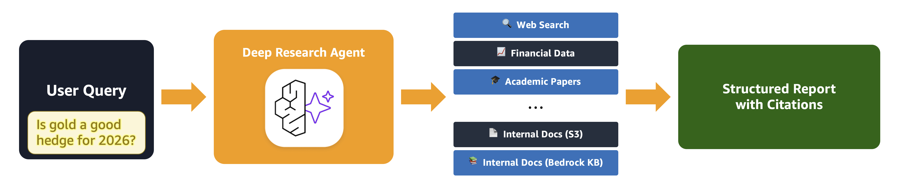
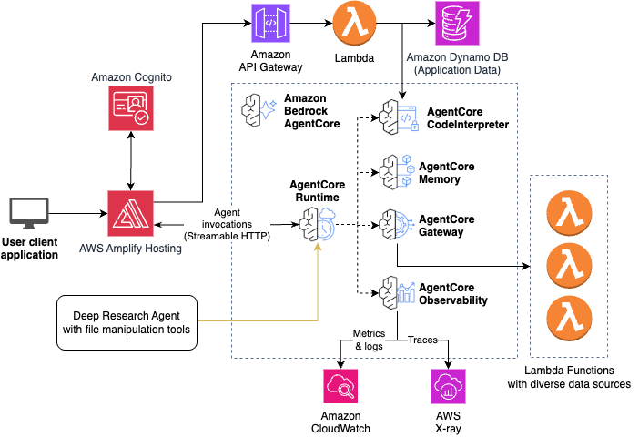

# AgentCore Deep Research Accelerator

AgentCore Deep Research template is a sample agentic AI solution for deep research built on Amazon Bedrock AgentCore. It conducts thorough research across multiple data sources and generates comprehensive reports with proper citations. The application features a modern React frontend with a split-pane interface showing real-time report generation alongside the chat. This sample is built using the [Fullstack Solution Template for AgentCore](https://github.com/awslabs/fullstack-solution-template-for-agentcore).




## ✨ Features

- **Multi-Source Research**: Search across the enterprise data (S3 or Knowledge Base), the Internet, academic papers, OpenFDA (drug data), AlphaVantage (commodities & economics) and more
- **S3 File Reader**: Read text files and PDFs directly from S3 (PDFs are auto-converted to markdown)
- **Structured 4-Step Workflow**: Scaffolds report, researches across sources, writes all sections with citations, and verifies completeness
- **Real-Time Report Display**: Split-pane UI shows the research report being built in real-time
- **Collapsible Sections**: Navigate long reports with collapsible H1/H2 sections and table of contents
- **Change Highlighting**: Green highlights show what changed in each report iteration
- **Proper Citations**: Every factual claim includes inline source citations with auto-extracted references section
- **Conversation Memory**: AgentCore Memory maintains context across sessions


## 🔧 Gateway Tools

The application includes Lambda-based tools behind AgentCore Gateway with OAuth authentication:

1. **Tavily Web Search** - Search the web for current information with relevance scoring
2. **Nova Web Search** - AWS-powered web search via Amazon Nova with citations
3. **ArXiv Search** - Search academic papers on arXiv by topic, author, or keywords
4. **OpenFDA Drug Search** - Search FDA drug label database for pharmaceutical information
5. **AlphaVantage Research** - Commodity prices (gold, oil, silver, etc.), US economic indicators (CPI, inflation, Fed rate, GDP, unemployment), and market news with sentiment analysis
6. **S3 File Reader** - Read text files and PDFs from S3 (PDFs auto-converted to markdown via pymupdf4llm)
7. **Knowledge Base Search** - Query Amazon Bedrock Knowledge Bases (requires configuration)

The modular architecture makes it easy to integrate additional data sources for developers.


## 🚀 Deployment

Deploying ADR requires a few CDK commands:

```bash
cd infra-cdk
npm install
cdk bootstrap  # Once per account/region
cdk deploy
cd ..
python scripts/deploy-frontend.py
```

See the [deployment guide](docs/DEPLOYMENT.md) for detailed instructions.

### Local Development

Local development requires a deployed stack because the agent depends on AWS services that cannot run locally:
- **AgentCore Memory** - stores conversation history
- **AgentCore Gateway** - provides tool access via MCP
- **SSM Parameters** - stores configuration (Gateway URL, client IDs)
- **Secrets Manager** - stores Gateway authentication credentials

You must first deploy the stack with `cdk deploy`, then you can run the frontend and agent locally using Docker Compose while connecting to these deployed AWS resources:

```bash
# Set required environment variables (see below for how to find these)
export MEMORY_ID=your-memory-id
export STACK_NAME=your-stack-name
export AWS_DEFAULT_REGION=us-east-1

# Start the full stack locally
cd docker
docker-compose up --build
```

**Finding the environment variable values:**
- `STACK_NAME`: Use the `stack_name_base` value from `infra-cdk/config.yaml`
- `MEMORY_ID`: Extract from the `MemoryArn` CloudFormation output (the ID is the last segment after `/`)
  ```bash
  aws cloudformation describe-stacks --stack-name <your-stack-name> \
    --query 'Stacks[0].Outputs[?OutputKey==`MemoryArn`].OutputValue' --output text
  # Returns: arn:aws:bedrock-agentcore:region:account:memory/MEMORY_ID
  ```
- `AWS_DEFAULT_REGION`: The region where you deployed the stack (e.g., `us-east-1`)

See the [local development guide](docs/LOCAL_DEVELOPMENT.md) for detailed setup instructions.


## ℹ️ Architecture



The architecture uses Amazon Cognito in four places:
1. User-based login to the frontend web application on CloudFront
2. Token-based authentication for the frontend to access AgentCore Runtime
3. Token-based authentication for the agents in AgentCore Runtime to access AgentCore Gateway
4. Token-based authentication when making API requests to API Gateway.

### Tech Stack

- **Frontend**: React with TypeScript, Vite, Tailwind CSS, and shadcn components
- **Agent**: Strands Agents SDK with BedrockModel
- **Authentication**: AWS Cognito User Pool with OAuth support
- **Infrastructure**: CDK deployment with Amplify Hosting for frontend and AgentCore backend


## 📂 Project Structure

```
agentcore-deep-research/
├── frontend/                 # React frontend application
│   ├── src/
│   │   ├── components/     # React components (shadcn/ui)
│   │   ├── hooks/          # Custom React hooks
│   │   ├── lib/            # Utility libraries
│   │   ├── services/       # API service layers
│   │   └── types/          # TypeScript type definitions
│   ├── public/             # Static assets and aws-exports.json
│   └── package.json
├── infra-cdk/               # CDK infrastructure code
│   ├── lib/                # CDK stack definitions
│   ├── bin/                # CDK app entry point
│   ├── lambdas/            # Lambda function code
│   └── config.yaml         # Deployment configuration
├── patterns/               # Agent pattern implementations
│   └── strands-deep-research/ # Deep Research agent
│       ├── deep_research_agent.py  # Main agent with Gateway tools
│       ├── report_upload_hook.py   # S3 upload for real-time display
│       ├── system_prompt.txt       # 4-round research workflow
│       ├── requirements.txt        # Agent dependencies
│       └── Dockerfile              # Container configuration
├── gateway/                # Gateway utilities and tools
│   └── tools/              # Gateway tool implementations
├── scripts/                # Deployment and test scripts
│   ├── deploy-frontend.py  # Cross-platform frontend deployment
│   └── test-*.py           # Various test utilities
├── docs/                   # Documentation source files
│   └── architecture-diagram/ # Architecture diagrams
├── tests/                  # Test suite
├── docker-compose.yml      # Local development stack
└── README.md
```


## ▶️ Usage

1. Open the application URL (from CDK outputs)
2. Log in with Cognito credentials
3. Toggle data sources (AlphaVantage, Tavily, Nova, ArXiv, etc.) as needed
4. Enter a research question
5. Watch as the agent:
   - Scaffolds report structure with key themes (Step 1)
   - Researches across enabled data sources (Step 2)
   - Writes all sections with citations (Step 3)
   - Verifies completeness and fills gaps (Step 4)


## 🔒 Security

Note: this asset represents a proof-of-value for the services included and is not intended as a production-ready solution. You must determine how the AWS Shared Responsibility applies to your specific use case and implement the needed controls to achieve your desired security outcomes. AWS offers a broad set of security tools and configurations to enable our customers.

Ultimately it is your responsibility as the developer to ensure all aspects of the application are secure. We provide security best practices in repository documentation and provide a secure baseline but Amazon holds no responsibility for the security of applications built from this tool.
