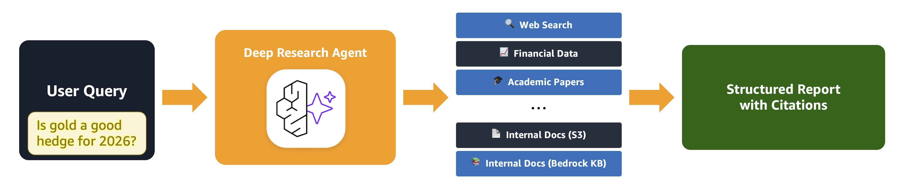
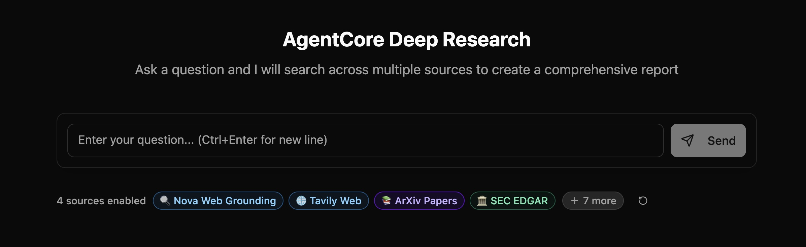
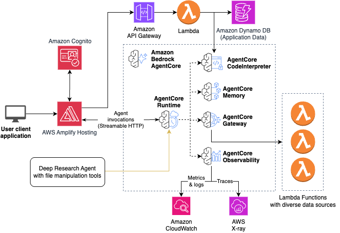

# AgentCore Deep Research

Sample open-source app that automates deep research on [Amazon Bedrock AgentCore](https://aws.amazon.com/bedrock/agentcore/). Given a user question, the AI agent iteratively queries data sources, cross-references findings, and generates a structured report with citations and visualizations. The app features a frontend with real-time streaming, over 10 configurable data connectors spanning enterprise data on AWS and external APIs, and a modular architecture based on the [FAST template](https://github.com/awslabs/fullstack-solution-template-for-agentcore). Read more in [our blog](https://builder.aws.com/content/2sLJJhyoVZLIco77zHkvN2IBB6P/accelerate-deep-research-workflows-with-amazon-bedrock-agentcore-application).



**✨ Key features:**
- **Multi-source analysis**: Search across enterprise data, Internet, and specialized APIs (10+ built-in sources)
- **Iterative workflow**: AI agent scaffolds report, researches the data, and creates a detailed report
- **Data visualization**: Agent generates charts and diagrams to enrich reports with quantitative insights
- **Real-time report display**: Split-pane UI shows the report being built in real-time and allows follow-ups
- **Fact-checking and citations**: Every factual claim includes inline source citations with the references section
- **RL fine-tuning**: Train and deploy your own model with reinforcement learning to optimize report quality at lower cost

<p align="left">
  
</p>

## 📊 Benchmarks

Evaluation results on standard deep research benchmarks from [TTD-DR](https://arxiv.org/abs/2507.16075) (correctness %):

| System | HLE-Search | GAIA | Avg. Rank | Includes Diagrams |
|--------|:----------:|:----:|:---------:|:-----------------:|
| TTD-DR | 33.9 | 69.1 | 1.0 | ✗ |
| OpenAI Deep Research | 29.1 | 67.4 | 2.0 | ✗ |
| AgentCore Deep Research** | 24.0 | 49.6* | 3.5 | ✓ |
| Perplexity Deep Research | 14.5 | 54.5 | 4.0 | ✗ |
| Grok DeeperSearch | 19.3 | 47.9 | 4.5 | ✗ |
| AgentCore Deep Research (all tools)** | 24.0 | 41.7* | 5.5 | ✓ |
| GPT-Researcher | 2.0 | 37.7 | 6.5 | ✗ |
| Open Deep Search | 3.0 | 20.9 | 7.5 | ✗ |

*\*GAIA evaluated on 127/165 validation questions (file-based questions excluded since the agent only has search tools).*

**Our results use Claude Sonnet 4 with Nova Web Grounding + Tavily Web Search (default web search tools), following our scaffold→research→write→verify workflow designed for comprehensive reports.

Run the evaluation yourself with `uv run test-scripts/eval-agent.py` (see [eval script](test-scripts/eval-agent.py) for details).

## 🚀 Deployment

**Prerequisites**: [Node.js 20+](https://nodejs.org/), [AWS CLI](https://docs.aws.amazon.com/cli/latest/userguide/getting-started-install.html), [AWS CDK](https://docs.aws.amazon.com/cdk/v2/guide/getting-started.html), [Python 3.10+](https://www.python.org/downloads/), [uv](https://docs.astral.sh/uv/), and [Docker](https://docs.docker.com/engine/install/). See [deployment guide](docs/DEPLOYMENT.md) for details.

Deploying AgentCore Deep Research stack requires a few commands:

```bash
cd infra-cdk
cp .config_example.yaml config.yaml  # Create your config (edit as needed)
npm install
cdk bootstrap  # Once per account/region
npm run deploy
```

Available deploy commands (run from `infra-cdk/`):

```bash
npm run deploy            # Backend + frontend
npm run deploy:frontend   # Frontend only
cdk deploy                # Backend only
```

See the [deployment guide](docs/DEPLOYMENT.md) for detailed instructions.

## ▶️ Usage



1. Open the application URL (from CDK outputs)
2. Log in with Cognito credentials
3. Toggle data sources (AlphaVantage, Tavily, Nova, ArXiv, etc.) as needed
4. Enter a research question
5. Watch as the agent:
   - Scaffolds report structure with key themes
   - Researches across enabled data sources
   - Writes all sections with citations
   - Verifies completeness and fills gaps
   - Generates charts and diagrams when the report has quantitative data
6. Ask follow-up questions and download the report (including any generated charts)


## ℹ️ Architecture



The architecture uses Amazon Cognito in four places:
1. User-based login to the frontend web application on CloudFront
2. Token-based authentication for the frontend to access AgentCore Runtime
3. Token-based authentication for the agents in AgentCore Runtime to access AgentCore Gateway
4. Token-based authentication when making API requests to API Gateway.

### Gateway Tools

The application includes multiple Lambda-based tools behind AgentCore Gateway with OAuth authentication:

| Tool | Domain | Description | API Key Required |
|------|--------|-------------|:---:|
| AlphaVantage Research | Finance | Commodity prices, US economic indicators, and market news with sentiment analysis | Yes |
| ArXiv Search | Science | Search academic papers on arXiv by topic, author, or keywords with category filtering | No |
| ClinicalTrials.gov Search | Life Science | Search clinical studies worldwide by condition, intervention, phase, and recruitment status | No |
| FRED Economic Search | Finance | Search 800,000+ economic time series from the Federal Reserve (GDP, CPI, unemployment, and more) | No |
| Knowledge Base Search | Generic | Query Amazon Bedrock Knowledge Bases (requires configuration) | No |
| Nova Web Grounding | Generic | AWS-powered web search via Amazon Nova with citations | No |
| OpenFDA Drug Search | Life Science | Search FDA drug label database for pharmaceutical information | No |
| PubMed Search | Life Science | Search peer-reviewed biomedical literature for abstracts, journal articles, and meta-analyses | No |
| S3 File Reader | Generic | Read text files and PDFs from S3 (PDFs auto-converted to markdown via pymupdf4llm) | No |
| SEC EDGAR Search | Finance | Search SEC company filings (10-K, 10-Q, 8-K) with optional full-text content retrieval | No |
| Tavily Web Search | Generic | Search the web for current information with relevance scoring and domain filtering | Yes |

The modular architecture makes it easy to integrate additional data sources for developers.

> **Note:** Several tools connect to external (non-AWS) APIs: Tavily, ArXiv, OpenFDA, AlphaVantage, FRED, PubMed, SEC EDGAR, and ClinicalTrials.gov. Of these, Tavily and AlphaVantage require API keys obtained through external registration. All external APIs, whether free or paid, are subject to the terms and conditions of their respective providers. We are not responsible for the availability, accuracy, or usage policies of third-party APIs. Please review each provider's terms before use. See the [deployment guide](docs/DEPLOYMENT.md) for stack setup instructions and which tools require API keys.

### Tech Stack

- **Frontend**: React with TypeScript, Vite, Tailwind CSS, and shadcn components
- **Agent**: Strands Agents SDK with BedrockModel
- **Authentication**: AWS Cognito User Pool with OAuth support
- **Infrastructure**: CDK deployment with Amplify Hosting for frontend and AgentCore backend


## 💻 Local Development

Local development requires a deployed stack because the agent depends on AWS services that cannot run locally:
- **AgentCore Memory** - stores conversation history
- **AgentCore Gateway** - provides tool access via MCP
- **SSM Parameters** - stores configuration (Gateway URL, client IDs)
- **Secrets Manager** - stores Gateway authentication credentials

You must first deploy the stack with `npm run deploy` (from `infra-cdk/`), then you can run the frontend and agent locally using Docker Compose while connecting to these deployed AWS resources:

```bash
# Set required environment variables (see below for how to find these)
export MEMORY_ID=your-memory-id
export STACK_NAME=your-stack-name
export AWS_DEFAULT_REGION=us-east-1

# Start the full stack locally
cd docker
docker compose up --build
```

**Finding the environment variable values:**
- `STACK_NAME`: Use the `stack_name_base` value from your `infra-cdk/config.yaml`
- `MEMORY_ID`: Extract from the `MemoryArn` CloudFormation output (the ID is the last segment after `/`)
  ```bash
  aws cloudformation describe-stacks --stack-name <your-stack-name> \
    --query 'Stacks[0].Outputs[?OutputKey==`MemoryArn`].OutputValue' --output text
  # Returns: arn:aws:bedrock-agentcore:region:account:memory/MEMORY_ID
  ```
- `AWS_DEFAULT_REGION`: The region where you deployed the stack (e.g., `us-east-1`)

See the [local development guide](docs/LOCAL_DEVELOPMENT.md) for detailed setup instructions.


## 🎓 SFT Distillation (Experimental)

Distil a frontier model's *research behaviour* into a small open model with LoRA
SFT, then serve it self-hosted. The student learns the full agentic trajectory —
which tools to call, in what order, how to build a report incrementally, and how
to cite sources — not just what a finished report looks like.

**Measured result** (98-question benchmark, identical harness for every model,
same judge, greedy sampling for both Qwen runs):

| Model | Score | Rubric | Citation | Format |
|---|--:|--:|--:|--:|
| Teacher model (frontier) | 0.738 | 0.677 | 0.971 | 1.000 |
| Mid-size reference model | 0.654 | 0.590 | 0.822 | 1.000 |
| **Qwen3.5-9B + trajectory SFT** | **0.616** | 0.558 | 0.917 | 0.778 |
| Qwen3.5-9B base | 0.487 | 0.458 | 0.247 | 0.957 |

SFT closes 58% of the base→teacher gap (+0.127, 95% CI [+0.088, +0.165], 72 wins
/ 16 losses / 1 tie, sign test p=1.2e-09). Nearly all of the gain is citation
quality: the base model emits unresolvable bare domains, the distilled model
learned the teacher's habit of citing full URLs.

### Why trajectories, not final reports

An earlier version of this pipeline trained on `question → final_report` pairs.
That teaches report-shaped prose without the research behaviour behind it, which
is a good recipe for confident fabrication. Every paper in this area
([DR-Venus](https://arxiv.org/abs/2604.19859),
[DeepSearch-World](https://arxiv.org/abs/2607.07820),
[DeepRubric](https://arxiv.org/abs/2606.17029),
[R²-Searcher](https://arxiv.org/abs/2606.28566)) trains on full multi-step
trajectories with tool observations **masked out of the loss** — otherwise the
model learns to invent search results.

Masking depends on a detail in the chat template that is easy to miss. TRL's
`assistant_only_loss` builds its mask from `` markers in the
template, and most published templates — Qwen3.5's included — have none.
Enabling the flag against such a template does not error: it silently trains on
the whole sequence, observations included, which is precisely the failure being
avoided. Observations are roughly half the tokens in a trajectory, so the loss
curve looks plausible either way; the only visible signal is that loss starts
much higher (4.06 versus 0.56 on a one-step probe).

TRL handles this for recognised model families by swapping in a marked-up
training template (see `trl/chat_templates/`), so there is nothing to configure.
What this pipeline adds is an assertion: training **refuses to start** if neither
the model's own template nor TRL provides generation markers, because for an
unlisted family the failure would otherwise be silent.

The same detail bites in reverse at inference time: `` is a
training-only construct, so the merged checkpoint is written with the *published*
template restored. Shipping the training template would either break a serving
stack that does not understand the tag, or silently change the prompt format the
model was tuned on.

### How it works

```
DATA GENERATION (teacher agent on Bedrock)
┌──────────────────────┐    ┌───────────────────────────┐    ┌────────────────────┐
│ sft_generate_data.py │───►│ Production agent          │───►│ AgentCore Gateway  │
│ captures the full    │    │ (teacher model + tools)   │    │ (Nova, ArXiv,      │
│ SSE trajectory       │◄───│ emits tool calls+results  │    │  PubMed, EDGAR...) │
└──────────┬───────────┘    └───────────────────────────┘    └────────────────────┘
           │ TRL tool-calling format; observations kept but masked at train time
           ▼
TRAINING (SageMaker ml.g6e.12xlarge — 4× L40S 48GB)
┌──────────────────────┐
│ TRL SFTTrainer       │  LoRA r=32 α=64, FSDP, max_seq_len 32768,
│ assistant_only_loss  │  observations masked via  template
└──────────┬───────────┘  → merged HF checkpoint (model.tar.gz)
           ▼
INFERENCE (SageMaker ml.g6e.16xlarge — 1× L40S)
┌──────────────────────┐    ┌───────────────────────────┐
│ vLLM endpoint        │◄───│ AgentCore Runtime         │  same agent code and
└──────────────────────┘    │ (same tools as prod)      │  same tools as production
                            └───────────────────────────┘
```

### Hardware requirements

| Stage | Instance | Why not smaller |
|---|---|---|
| Training | `ml.g6e.12xlarge` (4× L40S 48GB) | A trajectory is ~20K tokens, so `max_seq_length` must be 32768. That OOMs on 4× A10G 24GB (`ml.g5.12xlarge`). |
| Serving | `ml.g6e.16xlarge` (1× L40S 48GB) | 9B in BF16 plus KV cache for a 64K context. |

GPU capacity for these instance types fluctuates by region, and **available
capacity is not the same as having quota** — a job can sit `Pending` for hours in
one region while starting immediately in another. Launching in several regions
and keeping whichever starts first is the pragmatic approach.

### Steps

```bash
# 1. Generate research questions (seeded, so this is reproducible)
uv run test-scripts/sft_generate_questions.py --count 1000 --eval-count 0 --seed 7 \
    --output test-scripts/results/rl_train_data_1k.jsonl

# 2. Collect teacher trajectories. Resume-safe; ~550 trajectories/hour at
#    --max-concurrent 45. AgentCore parallelises well; Bedrock is the limit.
export EVAL_USERNAME=<cognito-user> EVAL_PASSWORD=<cognito-password>
uv run test-scripts/sft_generate_data.py \
    --questions test-scripts/results/rl_train_data_1k.jsonl \
    --max-concurrent 45 --observation-chars 1200 \
    --output test-scripts/results/sft_traces_1k.jsonl

# 3. Deploy training infra and build the training image
cd infra-cdk && npm run deploy:rl && cd ..
./training/build_and_push.sh sft

# 4. Train (LoRA). ~37h for 1,963 trajectories x 2 epochs on 4x L40S.
#    --lora-alpha defaults to 2x rank; do not pin it independently.
uv run test-scripts/sft_train.py \
    --data test-scripts/results/sft_traces_2k_fitted.jsonl \
    --s3-bucket <sagemaker-bucket-in-training-region> \
    --role-arn <RLTrainingRole ARN> \
    --hf-model-id Qwen/Qwen3.5-9B \
    --lora-rank 32 --epochs 2 --max-seq-length 32768 \
    --eval-fraction 0.05 --max-runtime 259200 \
    --instance-type ml.g6e.12xlarge

# 5. Serve the merged checkpoint (must be in the agent's region)
uv run test-scripts/deploy_model.py --job-name <training-job> \
    --endpoint-name dr-sft --instance-type ml.g6e.16xlarge \
    --tensor-parallel-degree 1 --max-model-len 65536 \
    --tool-call-parser qwen3_coder --reasoning-parser qwen3 \
    --enable-capacity-fallback --region us-west-2

# 6. Point the agent at it, then WAIT ~15 min (AgentCore does not hot-swap
#    images mid-session; evaluating too early scores an empty runtime)
uv run test-scripts/deploy_finetuned_agent.py --endpoint-name dr-sft

# 7. Evaluate against the frozen question set, and the base model for comparison
uv run test-scripts/eval-agent.py --benchmark rubric --max-questions 98 \
    --parallel 8 --tag sft --model qwen3.5-9b-sft --runtime-arn <finetuned runtime ARN>
```

## 🧠 RL Fine-Tuning (Experimental)

Train a small open model to produce better deep research reports than a larger frontier model using reinforcement learning with rubric-based rewards, powered by [AgentCore RL Toolkit](https://github.com/awslabs/agentcore-rl-toolkit).

**Goal:** A fine-tuned small model that beats a larger frontier model on report quality at a fraction of the inference cost.

### How it works

```
TRAINING (SageMaker ml.g5.12xlarge)
┌─────────────────────┐     ┌──────────────────────────┐     ┌─────────────────────┐
│  verl GRPO (FSDP)   │────►│  AgentCore Runtime       │────►│  AgentCore Gateway  │
│  train.py on Ray    │     │  (RL agent with tools)   │     │  (Tavily, Nova,     │
│                     │◄────│  returns rubric rewards   │     │   ArXiv, PubMed...) │
└──────────┬──────────┘     └──────────────────────────┘     └─────────────────────┘
           │
           │ rllm-model-gateway captures token IDs + logprobs
           │ vLLM serves current policy weights
           │
           ▼ --save-hf → model.tar.gz (HF safetensors + tokenizer)
┌─────────────────────┐
│  S3 Bucket          │
└──────────┬──────────┘
           │
INFERENCE (SageMaker ml.g5.xlarge)
           ▼
┌─────────────────────┐     ┌──────────────────────────┐     ┌─────────────────────┐
│  SageMaker Endpoint │◄────│  AgentCore Runtime       │────►│  AgentCore Gateway  │
│  (DJL/vLLM)        │     │  (finetuned agent, same  │     │  (same tools as     │
│                     │     │   code as production)    │     │   production)       │
└─────────────────────┘     └──────────────────────────┘     └─────────────────────┘
                                        ▲
                                        │
                                   Eval / Users
                               (same auth as production)
```

Each training step: prompts → agent produces full research reports using tools → reports scored against the shared rubric in `research_rubric.py` → GRPO computes advantages across N samples → model weights updated.

### Prerequisites

- Deployed deep research stack (`npm run deploy` from `infra-cdk/`)
- AWS account with SageMaker GPU quota (`ml.g5.12xlarge` for training jobs — 4× A10G GPUs)
- Cognito user credentials exported as `EVAL_USERNAME` and `EVAL_PASSWORD` (for eval)
- Docker or Finch installed (for building the training container)
- [AgentCore CLI](https://docs.aws.amazon.com/bedrock-agentcore/latest/devguide/get-started-cli.html) installed (`npm install -g @aws/agentcore`)

Check your GPU quotas:
```bash
aws service-quotas list-service-quotas --service-code sagemaker \
  --query 'Quotas[?contains(QuotaName, `training`) && (contains(QuotaName, `ml.g`) || contains(QuotaName, `ml.p`))].{Name:QuotaName,Value:Value}' \
  --output table
```

### Training data

Generate research questions that exercise tool use (shared with SFT pipeline):
```bash
# Generate 500 training + 100 eval questions across multiple domains
uv run test-scripts/sft_generate_questions.py --count 500 --eval-count 100
```

This produces `test-scripts/results/rl_train_data.jsonl` with one prompt per line:
```json
{"prompt": [{"role": "user", "content": "Research question here"}], "enabled_sources": ["tavily", "nova"], "metadata": {"prompt": "Research question here", "domain": "general", "tools": ["tavily", "nova"]}}
```

The `prompt` field is a chat-format message list. The `enabled_sources` field controls which tools the agent uses during training rollouts. Questions span 6 domains (general, finance, science, medical, policy, technology) to ensure broad tool-use coverage.

### Steps

```bash
# 1. Deploy RL training infrastructure (S3 bucket, RL agent runtime, IAM roles)
cd infra-cdk && npm run deploy:rl
```

Note the stack outputs — you'll need `RLAgentRuntimeArn` and `RLBucketName`:
```bash
aws cloudformation describe-stacks --stack-name deep-research-rl \
    --query 'Stacks[0].Outputs[*].[OutputKey,OutputValue]' --output table
```

```bash
# 2. Build and push training container to ECR (builds for linux/amd64)
./training/build_and_push.sh rl

# 3. Train with GRPO (launches SageMaker job, runs ~2-4 hours)
uv run test-scripts/rl_train.py \
    --data test-scripts/results/rl_train_data.jsonl \
    --agent-arn <RLAgentRuntimeArn> \
    --s3-bucket <RLBucketName> \
    --sft-job-name <completed-sft-job> \
    --instance-type ml.g6e.12xlarge

# 4. Deploy fine-tuned model as a SageMaker endpoint (vLLM)
uv run test-scripts/deploy_model.py --job-name <training-job-name> \
    --endpoint-name dr-finetuned --instance-type ml.g5.xlarge

# 5. Deploy a separate agent with the fine-tuned model
uv run test-scripts/deploy_finetuned_agent.py --endpoint-name dr-finetuned

# 6. Eval fine-tuned agent (runs alongside production agent)
export EVAL_USERNAME=<your-cognito-username>
export EVAL_PASSWORD=<your-cognito-password>
uv run test-scripts/eval-agent.py --benchmark hle-search --max-questions 50 \
    --tag finetuned
```

Monitor the training job in the [SageMaker console](https://console.aws.amazon.com/sagemaker/home#/jobs) or via CLI:
```bash
aws sagemaker describe-training-job --training-job-name <job-name> \
    --query '{Status:TrainingJobStatus,SecondaryStatus:SecondaryStatus}'
```

Training runs on the [verl](https://github.com/volcengine/verl) backend with the FSDP engine, so the model architecture is read from `config.json` — there is no per-model script to maintain. Attention comes from HuggingFace transformers, which is what allows unusual head dimensions to train without a fused-kernel fallback.

### Reward function

Reports are scored on a 0–1 scale combining three signals. The weights and all
scoring logic live in `patterns/strands-deep-research/research_rubric.py`, which
is the single source of truth shared by evaluation and RL:

| Signal | Weight | Method |
|--------|:------:|--------|
| Rubric quality | 80% | LLM judge scores 6 criteria, including grounding of claims in sources |
| Citation validity | 10% | Counts *distinct well-formed URLs*, and rejects citations absent from the URLs the tools actually returned |
| Format compliance | 10% | Each expected section must carry real body text, not just a heading |

### Architecture

| Component | Role | Managed by |
|-----------|------|------------|
| AgentCore Runtime | Runs parallel agent rollouts in isolated microVMs | AWS (serverless) |
| SageMaker Training | GPU cluster for GRPO weight updates | CDK stack |
| rllm-model-gateway | Captures token IDs/logprobs from inference | Training container |
| vLLM | Serves current policy weights during training and inference | Training container / SageMaker endpoint |
| S3 | Data exchange: prompts ↔ rewards ↔ checkpoints | CDK stack |
| `rl_app.py` | RL-adapted agent (same tools, `OpenAIModel` instead of `BedrockModel`) | This repo |

See `test-scripts/rl_train.py` for the training script and `patterns/strands-deep-research/rl_app.py` for the RL-adapted agent.


## 📂 Project Structure

```
agentcore-deep-research/
├── frontend/                 # React frontend application
│   ├── src/
│   │   ├── components/     # React components (shadcn/ui)
│   │   ├── hooks/          # Custom React hooks
│   │   ├── lib/            # Utility libraries
│   │   ├── services/       # API service layers
│   │   └── types/          # TypeScript type definitions
│   ├── public/             # Static assets and aws-exports.json
│   └── package.json
├── infra-cdk/               # CDK infrastructure code
│   ├── lib/                # CDK stack definitions
│   ├── bin/                # CDK app entry point
│   ├── lambdas/            # Lambda function code
│   ├── .config_example.yaml # Example deployment configuration (copy to config.yaml)
│   └── config.yaml         # Your deployment configuration (gitignored)
├── patterns/               # Agent pattern implementations
│   └── strands-deep-research/ # Deep Research agent
│       ├── deep_research_agent.py  # Main agent with Gateway tools
│       ├── report_upload_hook.py   # S3 upload for real-time display
│       ├── system_prompt.txt       # 5-step research workflow
│       ├── requirements.txt        # Agent dependencies
│       └── Dockerfile              # Container configuration
├── tools/                  # Agent tool implementations
│   ├── code_interpreter/   # Code interpreter for chart generation
│   └── data_analysis/      # Data analysis advisor prompt
├── gateway/                # Gateway utilities and tools
│   └── tools/              # Gateway tool implementations
├── docker/                 # Local development Docker setup
│   └── docker-compose.yml  # Docker Compose for local stack
├── scripts/                # Deployment and test scripts
│   └── deploy-frontend.py  # Cross-platform frontend deployment
├── docs/                   # Documentation source files
├── tests/                  # Test suite
└── README.md
```

## 🔒 Security

Note: this asset represents a proof-of-value for the services included and is not intended as a production-ready solution. You must determine how the AWS Shared Responsibility applies to your specific use case and implement the needed controls to achieve your desired security outcomes. AWS offers a broad set of security tools and configurations to enable our customers.

Ultimately it is your responsibility as the developer to ensure all aspects of the application are secure. We provide security best practices in repository documentation and provide a secure baseline but Amazon holds no responsibility for the security of applications built from this tool.

## 👤 Team

|  |  |  |  |
|---|---|---|---|
| [Nikita Kozodoi](https://www.linkedin.com/in/kozodoi/) | [Aiham Taleb](https://www.linkedin.com/in/aihamtaleb/) | [Jack Butler](https://www.linkedin.com/in/jackbutler-a/) | [Elizaveta Zinovyeva](https://www.linkedin.com/in/zinov-liza/) |
